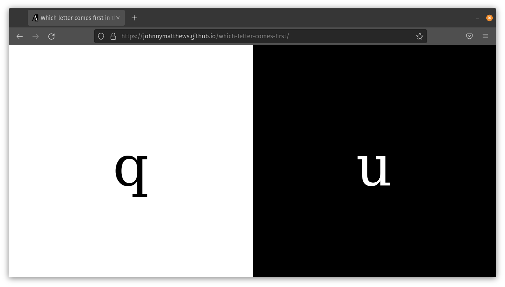

# Which letter comes first?

[View demo](https://johnnymatthews.github.io/which-letter-comes-first/)

Look, this repo really shouldn't need a readme, but GitHub shouts at you if you don't have one, so here it is. This site shows two letters, and the user has to click which one comes _first_ in the alphabet. It's pretty simple stuff.

This project uses [Reset.css from meyerweb.com](http://meyerweb.com/eric/tools/css/reset/) because I'm too lazy to build my own.

PRs will only be accepted if you include a funny joke in the PR comment.

